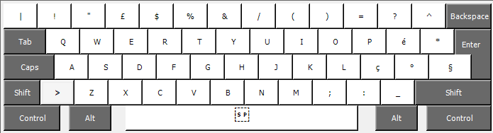

# Italian Advanced Keyboard Layout

Il repository contiene il sorgente e i pacchetti installabili per un layout avanzato di una tastiera italiana.

Il layout è stato creato con Microsoft Keyboard Layout Creator 1.4 ed è compatibile con Windows 7, 8 e 10. Gli installabili compilati sono 32bit, 64bit e IA64.

**Attenzione**: La tastiera è basata su una tastiera IT, quindi compatibile con tutti i software. I caratteri aggiuntivi (pringipalmente quelli in <kbd>Alt Gr</kbd> e <kbd>Alt Gr</kbd> + <kbd>Shift</kbd>) sono **UTF-8** e quindi utilizzabili solo in applicazioni che supportano UTF-8. Molto spesso, è possibile incontrare un conflitto tra caratteri e scorciatoie da tastiera. Offiamente, **le scorciatoie da tastiera hanno la precedenza**.

**Attenzione**: Ho fatto una piccola modifica al sorgente, e Windows forza un cambio di nome e di descrizione nella tastiera, che diventa quindi `ItAdv2`. In particolare si è aggiunto il Backtick in posizione <kbd>Alt Gr</kbd> + <kbd>'</kbd>, come `it_IT.utf-8` Linux.
Non ho modificato le informazioni di installazione e le immagini, ma per l'utente nulla cambia.

## Installazione

 * Scaricare dal repository l'installer specifico per il proprio sistema, nella direcotry setup. Per installare correttamente, è necessario scaricare anche la directory allegata, che contiene la dll del layout.
   dynamic lybrary che implementa il layout.
 * Lanciare l'installer come Amministratore (la installazione è pressochè immediata)
 * **Riavviare il sistema** (fino al riavvio la tastiera **non** è disponibile nelle impostazioni di sistema).
 * Aprire le impostazioni e portarsi alle impostazioni della lingua.

   
    
    

## Layout

### Nessun modificatore

 

### Modificatore <kbd>Shift</kbd>

 

### Modificatore <kbd>Alt Gr</kbd>

 

### Modificatore <kbd>Alt Gr</kbd> + <kbd>Shift</kbd>

 

## Modifiche

Per modificare il layout, instalare l'editor [Microsoft Keyboard Layout Creator 1.4](https://www.microsoft.com/en-us/download/details.aspx?id=22339) e aprire il file `ItAdv.klc`.

Le modifiche richiedono di rinominare la tastiera e la sua descrizione, mediante il menu apribile in `Project → Properties`. Per costruire il progetto usare `Project → Build DLL and Setup Package`. Installare la DLL e riavviare; per completare l'installazione selezionare il layout mediante <kbd>Space</kbd> + <kbd>Meta</kbd> (tasto <kbd>Win</kbd> o <kbd>Cmd</kbd>).
